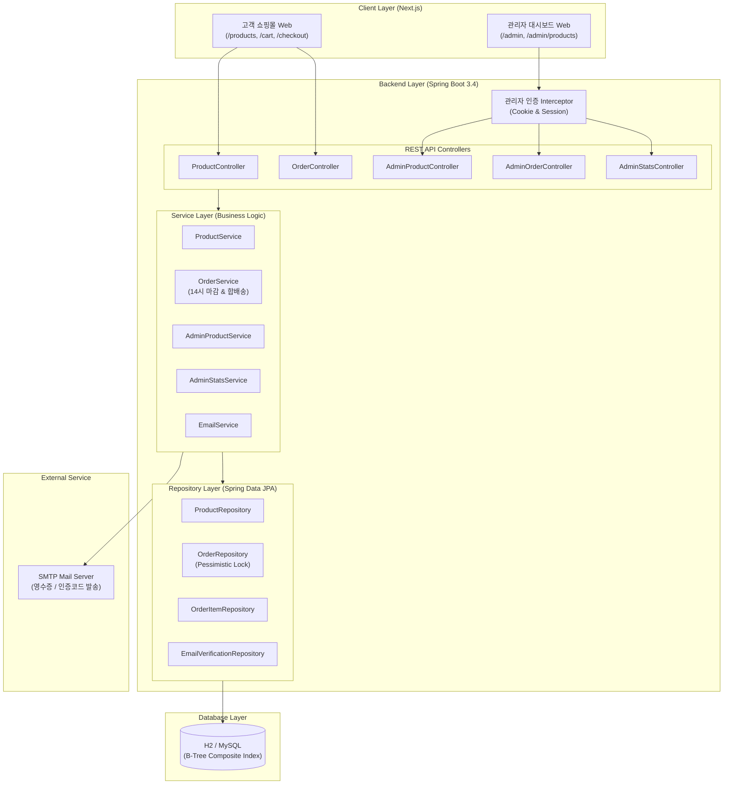
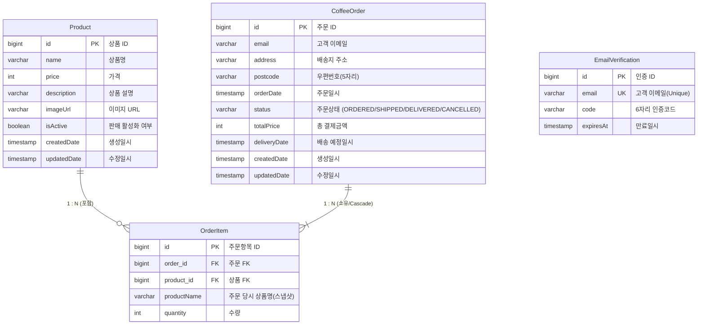

# ☕ Grids & Circles Coffee (콩 볶는 사람들)

> **"14시 배송 마감과 스마트 합배송 시스템으로 완성하는 커피 커머스 플랫폼"**  
> 상품 탐색부터 14시 당일 배송 정책, 자동 합배송, 관리자 통계 대시보드까지 하나의 흐름으로 연결한 풀스택 커머스 서비스입니다.

<br>

<p align="center">
  
  
  
  
  
  
</p>

---

## 📌 목차 (Table of Contents)
1. [프로젝트 소개 & 핵심 가치](#intro)
2. [팀원 구성 및 역할](#team)
3. [시스템 아키텍처](#architecture)
4. [데이터베이스 설계 (ERD)](#erd)
5. [주요 핵심 기능](#features)
6. [기술적 챌린지 및 성능 최적화](#performance)
7. [주요 트러블슈팅 (Troubleshooting)](#troubleshooting)
8. [시작 가이드 (Getting Started)](#getting-started)

---

## <span id="intro"></span>📖 프로젝트 소개 & 핵심 가치

**Grids & Circles Coffee**는 신선한 당일 로스팅 원두 유통에 특화된 D2C 커피 커머스 서비스입니다.  
단순한 쇼핑몰 CRUD를 넘어 **현실의 물류 정책과 비즈니스 로직을 정교한 도메인 모델로 풀어내고**, **100만 건 대용량 벤치마크 및 동시성 락을 통해 안정적인 백엔드 시스템**을 구축했습니다.

### ✨ Core Value
* ⏰ **14시 당일 배송 마감 정책:** 로스팅 신선도를 위해 14시 이전 주문은 당일 출고, 이후 주문은 익일 출고로 자동 스케줄링
* 📦 **스마트 당일 자동 합배송:** 동일 고객이 14시 이전 동일 배송지로 재주문 시 기존 주문에 자동 병합하여 배송비 절감
* 📊 **관리자 KPI 대시보드:** 당일 출고 대상 주문 즉시 필터링, 기간별 매출 통계 및 동적 정렬/페이징 제공
* 🔐 **비회원 이메일 인증 주문 관리:** 회원가입의 번거로움 없이 6자리 이메일 인증을 통해 안전한 주문 조회/수정/취소 지원

---

## <span id="team"></span>👥 팀원 구성 및 역할 (TEAM 05)

| 천종원 | 송영빈 | 이세진 | 석경진 | 김기백 |
| :---: | :---: | :---: | :---: | :---: |
| **고객 기능** | **관리자 기능** | **장바구니** | **주문 관리** | **배송·주문 정책** |
| • 상품 조회 및 검색<br>• 고객 메인 쇼핑몰 UI<br>• 이메일 입력 및 주문 연결 | • 관리자 상품 CRUD<br>• 관리자 운영 UI<br>• 매출 통계 대시보드 연동 | • 장바구니 담기/삭제<br>• 실시간 수량·총액 계산<br>• 이메일 영수증 연동 | • 주문 생성/조회/수정/취소<br>• Order/OrderItem 도메인<br>• 이메일 소유자 인증 | • 14시 마감 및 합배송 정책<br>• 100만건 인덱스 튜닝<br>• 동시성(비관적 락) 검증 |

---

## <span id="architecture"></span>🏗️ 시스템 아키텍처



---

## <span id="erd"></span>🗄️ 데이터베이스 설계 (ERD)



* **스냅샷 보존 (`productName`):** 상품 정보가 변경되더라도 과거 주문 데이터의 정합성을 위해 주문 시점의 상품명을 `OrderItem`에 복제 저장
* **배송일자 관리 (`deliveryDate`):** 14시 마감 정책에 따른 출고 예정일을 명시적 컬럼으로 관리하여 당일 출고 필터링 성능 극대화

---

## <span id="features"></span>🚀 주요 핵심 기능

### 1. 고객 (Customer) 기능
* **원두 탐색 & 실시간 검색:** 판매 중인 원두 라인업 조회 및 키워드 기반 실시간 검색
* **장바구니 인터랙션:** 수량 증감, 단건/전체 삭제, 실시간 주문 총액 자동 계산
* **14시 당일 배송 마감 안내:** 상단 마감 안내 문구 및 실시간 시계 표기
* **주문 생성 & 유효성 검증:** 5자리 숫자 우편번호 유효성 검사 및 결제 영수증 이메일 자동 발송
* **스마트 당일 합배송:** 14시 이전 동일 배송지 재주문 시 기존 주문 건으로 자동 병합 (수량/금액 누적)
* **이메일 인증 기반 주문 관리:** 6자리 인증 코드를 통한 주문 내역 조회, 배송 전(`ORDERED`) 상태일 때 배송지 수정 및 주문 취소

### 2. 관리자 (Admin) 기능
* **보안 로그인 & 인가 제어:** 전용 보안 코드 기반 로그인 및 미인가자 경로 차단
* **매출 통계 & KPI 대시보드:** 총 매출액, 주문 건수 확인 및 기간별(`오늘`/`최근 7일`/`최근 6개월`/`전체`/`날짜 직접 지정`) 집계
* **오늘 배송 대상 우선 조회:** 당일 14시 출고 대상 주문 원클릭 필터링
* **주문 통합 관리 & 상태 전이:** 이메일·상품명 검색, 서버 페이징, 배송 상태 변경 (`ORDERED` ➔ `SHIPPED` ➔ `DELIVERED`)
* **상품 라인업 관리:** 판매 상태(`전체`/`판매중`/`판매중단`) 필터링, 신규 원두 등록 및 이미지 업로드

---

## <span id="performance"></span>⚡ 기술적 챌린지 및 성능 최적화

### 1. 100만 건 대용량 벤치마크 & 복합 인덱스 튜닝
대량 데이터 환경에서 Full Table Scan으로 인한 성능 저하를 방지하기 위해 핵심 조회 패턴에 맞춘 **B-Tree 복합 인덱스**를 설계하고 정량적으로 검증했습니다.

| 주요 쿼리 | 적용 인덱스 구성 | 개선 효과 |
| :--- | :--- | :---: |
| **당일 배송 대상 주문 조회** | `(deliveryDate, orderDate)` | **FileSort 제거 및 조회 성능 극대화** |
| **고객별 최근 미배송 주문 탐색** | `(email, status, orderDate)` | **86ms ➔ 11ms (약 87% 단축)** |
| **관리자 다중 조건 검색 및 페이징** | `(status, orderDate)` | **페이징 쿼리 인덱스 스캔 처리** |
| **특정 고객 전체 주문 내역 조회** | `(email, orderDate)` | **75ms ➔ 5ms (약 93% 단축)** |

### 2. 비관적 락(Pessimistic Lock)을 통한 합배송 동시성 제어
동일 고객이 14시 이전에 짧은 간격으로 동시에 주문을 요청할 때 발생할 수 있는 Race Condition(기존 주문 중복 조회 및 수량 누락)을 방지하기 위해 `findTopByEmailAndAddressAndPostcodeAndStatusOrderByOrderDateDesc` 조회 시 **`PESSIMISTIC_WRITE` 락**을 적용하여 데이터 정합성을 100% 보장했습니다.

### 3. 10,000건 부하 스트레스 테스트 (안정성 검증)
* **가용성 100% 달성:** 10,000건의 동시 주문 부하 상황에서도 **실패율 0% (10,000/10,000 성공)** 기록
* **Latency Spike 억제:** 엔티티 구조 변경 및 영속성 컨텍스트 최적화를 통해 고부하(10ms 간격) 상황에서도 최대 응답 지연을 **1,348ms ➔ 529ms**로 대폭 억제하고 평균 **165ms**의 균일한 응답성 확보

---

## <span id="troubleshooting"></span>🛠️ 주요 트러블슈팅 (Troubleshooting)

### 1. API 응답 페이징 구조 변경 (`List` ➔ `Page`)
* **문제:** 백엔드에서 대용량 데이터를 위해 `List<T>`에서 `Page<T>`로 변경 시 프론트엔드 목록 렌더링이 깨지는 현상 발생
* **해결:** `data.content`와 `data.totalPages` 등 페이지 메타데이터를 분리하여 프론트-백엔드 간의 API 계약(Contract)을 재정립

### 2. 고객 API와 관리자 API/DTO 분리
* **문제:** 고객과 관리자가 동일한 `/api/v1/products`를 공유하여 고객 페이징 변경이 관리자 대시보드 통계 및 전체 목록에 사이드 이펙트 유발
* **해결:** `/api/v1/products`(고객용: 활성 상품만)와 `/api/v1/admin/products`(관리자용: 판매중/중단/영구삭제)로 Controller, Service, DTO를 명확히 분리하여 책임 분리 실현

### 3. Next.js 관리자 인증 상태 반영 동기화
* **문제:** 관리자 로그인 성공 후 `router.push("/admin")` 이동 시 서버 컴포넌트 인터셉터가 최신 쿠키를 즉시 인식하지 못하고 다시 로그인 페이지로 리다이렉트되는 문제
* **해결:** 쿠키 속성을 `SameSite=Lax`로 조정하고, 클라이언트 라우팅 대신 브라우저 네이티브 재요청(`window.location.replace`)을 사용하여 안전하게 세션 동기화

### 4. 상품 판매 중단(Soft Delete)과 영구 삭제(Hard Delete) 분리
* **문제:** 상품 삭제 시 DB에서 `DELETE`하여 과거 주문 이력(`OrderItem`)과의 참조 무결성 오류 발생
* **해결:** 일상적인 판매 중지는 `isActive = false`로 상태를 전이(Soft Delete)하고, 주문 이력이 없는 상품에 한해서만 영구 삭제를 허용하도록 안전장치 마련

---

## <span id="getting-started"></span>🏁 시작 가이드 (Getting Started)

### Prerequisites
* Java 21+
* Node.js 18+ & npm

### Backend 실행
```bash
cd back
./gradlew bootRun
```
* **Server Port:** `http://localhost:8080`
* **Swagger API Docs:** `http://localhost:8080/swagger-ui/index.html`

### Frontend 실행
```bash
cd front
npm install
npm run dev
```
* **Client App:** `http://localhost:3000`
* **Admin App:** `http://localhost:3000/admin`
